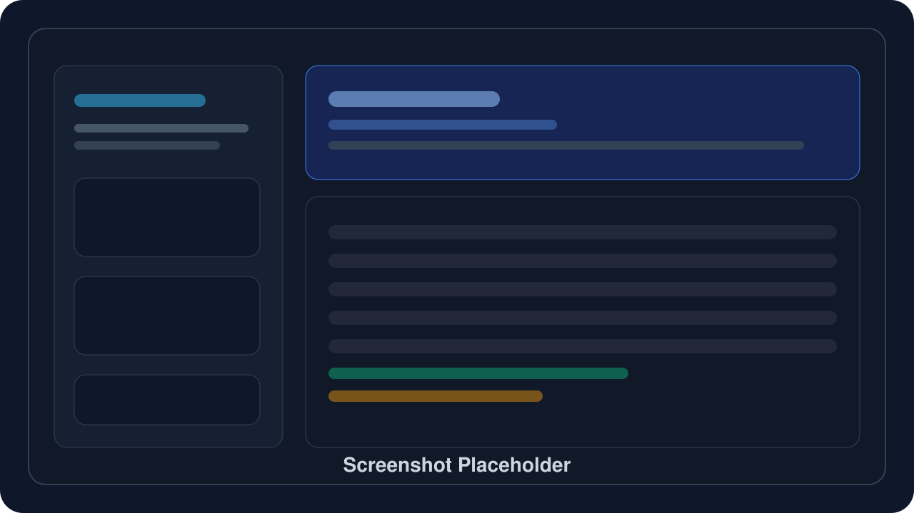

# codexs

codexs 是一个面向 macOS 的桌面工具，用于批量生成 OpenAI 账号、整理生成后的 token，并一键导入到 Codex Tools。项目基于 `Tauri v2 + React + TypeScript + Rust + Python` 构建，适合需要在本地维护多账号池和快速导入工作流的场景。

## 功能特性

- 批量生成 OpenAI 账号，支持一次性提交多个生成任务
- 实时显示生成进度、当前邮箱、成功数和失败信息
- 自动将原始 token 转换为 Codex Tools 可识别的格式
- 按账号勾选导入到 Codex Tools，并记录导入状态
- 将本地状态数据持久化到应用数据目录，便于后续继续管理

## 安装

1. 打开 GitHub Releases 页面，下载最新版本的 `.dmg` 安装包。
2. 根据你的 Mac 芯片选择对应架构：
   - Apple Silicon：下载文件名包含 `aarch64` 的版本
   - Intel：下载文件名包含 `x86_64` 的版本
3. 双击挂载 `.dmg`，将 `codexs.app` 拖入“应用程序”目录。
4. 首次运行前，请确认本机已安装 `python3`。当前版本会调用系统 Python 执行内置自动化脚本。

## 使用说明

1. 启动应用，在“批量生成账号”区域输入需要生成的账号数量。
2. 点击“开始生成”，等待进度条和结果列表刷新。
3. 在账号列表中勾选要导入的账号。
4. 点击“导入到 Codex Tools”，等待导入完成提示。
5. 打开或重启 Codex Tools，确认账号已经出现在账号列表中。

补充说明：

- 生成后的 token 与状态文件默认保存在 `~/Library/Application Support/com.codexs.app/`
- Codex Tools 导入目标文件为 `~/Library/Application Support/com.carry.codex-tools/accounts.json`

## 截图



> TODO: 将真实界面截图替换为主界面、生成完成态和导入完成态三张图片。

## 开发指南

### 环境要求

- macOS 11 或更高版本
- Node.js 20+
- Rust stable toolchain
- Python 3.11+
- Xcode Command Line Tools

### 本地开发

```bash
npm ci
python3 -m pip install -r scripts/requirements.txt
npm run tauri dev
```

### 本地打包

```bash
npm run tauri:build:mac
npm run tauri:build:mac:arm64
npm run tauri:build:mac:x64
```

### 发布流程

1. 确认 `package.json`、`src-tauri/tauri.conf.json` 和 `src-tauri/Cargo.toml` 的版本号一致。
2. 创建并推送版本标签，例如：

```bash
git tag v0.1.0
git push origin v0.1.0
```

3. GitHub Actions 会自动执行 macOS 双架构构建，并将产物上传到对应 Release。

### GitHub Actions 签名说明

发布工作流支持两种模式：

- 未配置 Apple 签名密钥时，自动回退为 ad-hoc 签名，便于内部测试分发
- 配置完整 Apple 密钥后，可生成正式签名并继续扩展到 notarization 流程

如需正式签名，请在 GitHub 仓库 Secrets 中配置以下变量：

- `APPLE_CERTIFICATE`
- `APPLE_CERTIFICATE_PASSWORD`
- `APPLE_SIGNING_IDENTITY`（可选，未提供时由 Tauri 自动推断）
- `APPLE_ID`
- `APPLE_PASSWORD`
- `APPLE_TEAM_ID`

## 项目结构

- `src/`：React 前端界面
- `src-tauri/`：Rust 命令、Tauri 配置和 macOS 打包元数据
- `scripts/`：OpenAI 注册、token 转换和 Codex Tools 导入脚本
- `.github/workflows/release.yml`：GitHub 标签发布流水线
